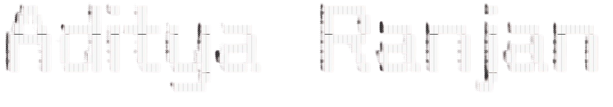
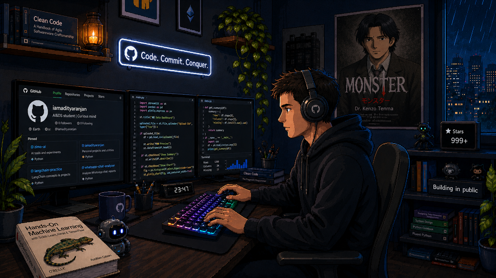
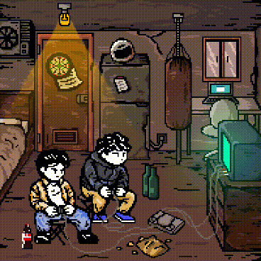
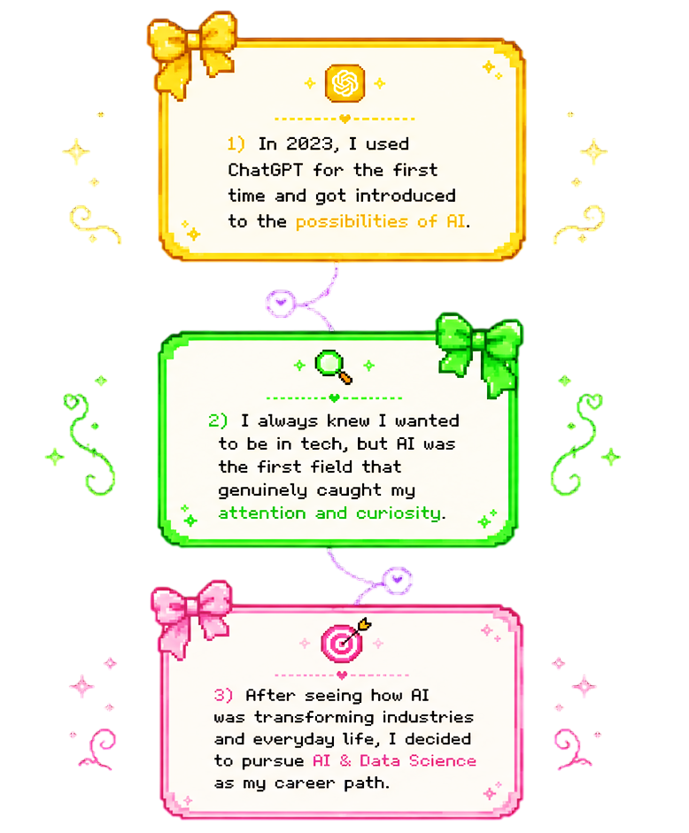

  

<h4 align="center">
  AI & Data Science Student | Curious Learner | Project Builder
</h4>

 

  

 

  

## 🚀 About Me

<table>
<tr>

<td width="65%">

   
  

Currently exploring Deep Learning concepts like CNNs and RNNs while trying to understand the core logic behind how things actually work. I enjoy implementing concepts, learning something new every day, pixelated art, cozy coding vibes, and a good cup of tea ☕

- 🌍 Based in Pune
- 🚀 Working on [Zimo AI](https://zimoai.vercel.app/)
- ✉️ You can contact me at ai.adityaranjan@gmail.com
- 🧠 Learning Convolutional Neural Networks

</td>

<td width="35%" align="center">

</td>

</tr>
</table> 

---

# 🛠️ Skills

<table width="100%">
<tr>

<td valign="top" width="25%">

### 💻 Languages

  

</td>

<td valign="top" width="25%">

### ⚡ Frameworks

  

</td>

<td valign="top" width="25%">

### 🗄️ Databases

  

</td>

<td valign="top" width="25%">

### 🛠️ Tools & Design

  

</td>

</tr>
</table>

## 💼 Profiles & Links

## 🔥 Contribution Journey

  

## 🌌 Activity Dashboard

  

  

## 📜 What Led Me Here

  

